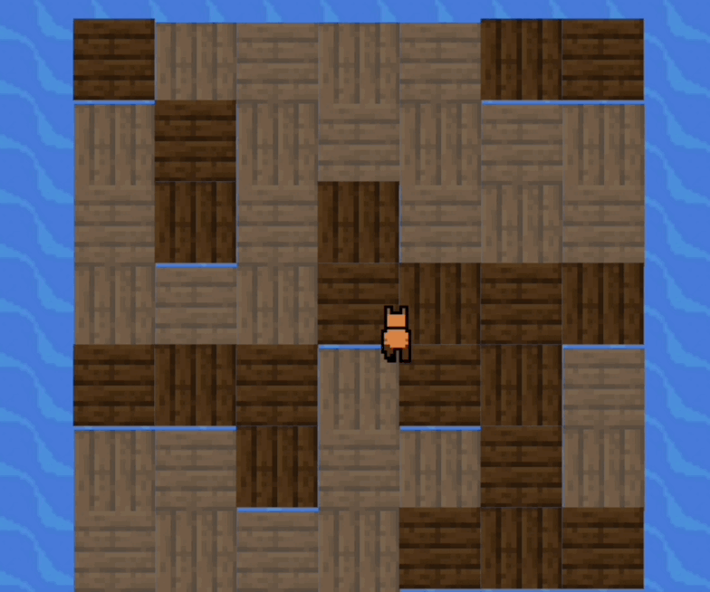

# CapyBaby

CapyBaby is a survival game where the player has to stay alive on a raft for as long as possible. The raft is set up as a 7x7 grid, and at set increments, random tiles will shake. The player will then have to get to a non-shaking tile before the tiles drop. As the game progresses, the amount of tiles that fall increases until only one tile remains. Each time a player survives a wave of tiles falling, 100 points are added to their score.

## Functionality

### Start:
Upon pressing start, CapyBaby will fall onto the raft and lay down for a brief moment before standing back up. Simultaneously, a '3-2-1' countdown will appear on the raft. This functionality was build by setting SetTimeout booleans that become 'true' as the numbers should be displayed.

### Game Loop:
When the game starts, the tiles will flash, drop, and reset at set intervals. This logic was built in a SetInterval method, where the modulo operator indicated if the iteration should flash tiles, drop tiles, or reset tiles. The difficulty increases over time according to a dynamic 'dropSquares' method in the Raft class.

 

### Player Movement:
Player movement is determined by linking x and y velocity to document event listeners. The current velocity determines the direction the player is facing. Animation of the directions was accomplished by ripping a sprite sheet and cycling through 5 images every 6 frames.

 - insert picture & code

### Instructions:
An instructions menu is available in the page header as a modal element. Upon clicking the 'instructions' button, the screen darkens and the user can see the instructions in the center of the screen.

## Technologies, Libraries, APIs
 - The Canvas API to render and animate the raft, background, and sprites.
 - Webpack to bundle and transpile the source JavaScript code.
 - npm to manage project dependencies.

## Implementation Timeline

Friday Afternoon & Weekend
 - Learn canvas (rendering & animations)
 - Begin work on game logic

Monday
 - Animation loop
 - Graph and tile logic
 - Scaling difficulty

Tuesday
 - Render raft
 - Render background
 - Animate player

Wednesday
 - Render score
 - Create instructions modal
 - Game over screen

Thursday
 - E2E Testing, add extra features if time allots

***

Sprites designed by: Rainloaf
